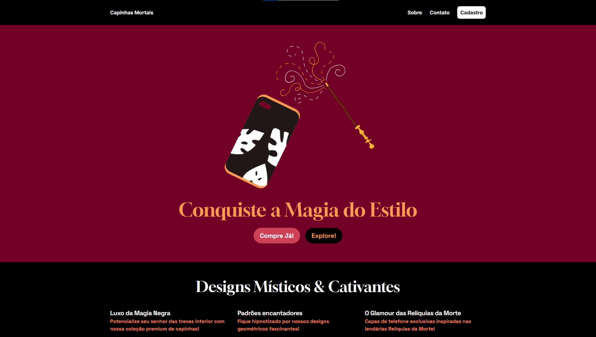

# Capinhas-Mortais (Deathly Covers)

This repository is part of a series of website development exercises where the focus is on imagining web pages for **unlikely situations**.

This specific web site tries to answer the following question: What if Lord Voldemort dropped that idea of achieving immortality and decided to sell cell phone cases in a store downtown, what would his website look like?"

Deploy: https://viniciusgalmeida.github.io/Capinhas-Mortais/

